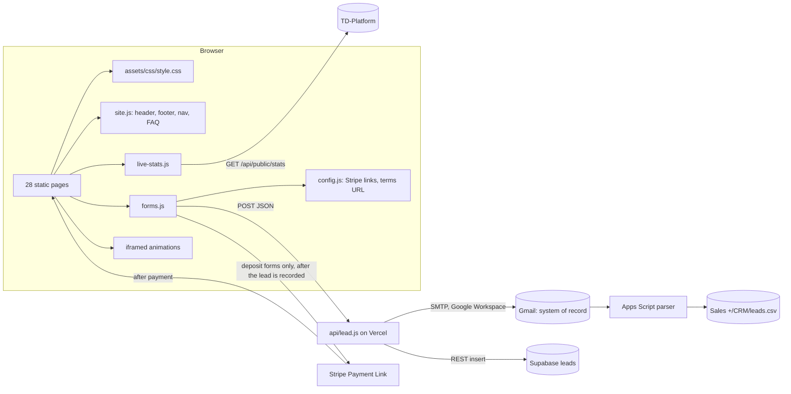

# Architecture

## The shape

Nothing is compiled. What is in the repo is what is served, with two
exceptions: `assets/animations/homepage-flow-v2.html` is generated by
`build-homepage-anim.js` from a scene file, and `api/lead.js` runs as a Vercel
serverless function rather than being served as a file.

## Pieces

**Pages.** Hand-written HTML, one `index.html` per folder so every URL ends in
a slash. Root-relative links (`/hydronic/`) so a page works at any depth. Every
page carries the same `<head>` pattern: canonical, Open Graph, favicon,
Montserrat preloads (ExtraBold and Regular, the two above the fold), and the
stylesheet with a `?v=` query.

**`assets/css/style.css`.** One file, about 1,300 lines, layered in dated
blocks appended over time (v4 through v8). Source order is load-bearing: later
blocks win ties. See [design-system.md](design-system.md).

**`assets/js/site.js`.** Injects the shared header and footer into
`<header id="site-header">` and `<footer id="site-footer">`, marks the current
nav item, handles the mobile menu, the sticky-header state, the partner-logo
upgrade, the iframe auto-height contract (below) and the FAQ slide.

**`assets/js/forms.js`.** Progressive enhancement for any
`<form data-lead-form="...">`. Native validation runs first; the script takes
over the submit, posts JSON to `/api/lead`, and routes to the form's
`data-redirect` thank-you page, or, for a deposit form, to the Stripe link
named by `data-stripe-key`. A failed send always surfaces a `mailto:` fallback
so a lead is never silently lost.

**`assets/js/config.js`.** The only place a Stripe Payment Link URL or the
terms URL is written. Elements with `data-stripe` or `data-terms-link` get
their `href` from here at load.

**`assets/js/live-stats.js`.** Elements with `data-live-stat="<key>"` hold
audited static figures in the HTML. On first scroll into view each tickers up
to that figure; if `https://thermal-dawn-platform.vercel.app/api/public/stats`
answers, the target switches to the live fleet value and the counter glides to
it. Keys: `totalSavedAud`, `gasAvoidedMj`, `co2AvoidedKg` for the fleet;
`fi:savedAud`, `fi:gasMj`, `fi:co2Kg` for the first install. Honours
`prefers-reduced-motion`.

**`api/lead.js`.** One function behind all five forms. Validates, screens
bots, emails a fixed-layout notification, writes a Supabase row, sends an
autoresponder. See [lead-pipeline.md](lead-pipeline.md).

**Animations.** Self-contained HTML files in `assets/animations/`, iframed
into pages. They post their rendered height to the parent
(`td:frameHeight`) and `site.js` sizes the iframe; never animate the width of
an iframe's ancestor or the contract breaks. Which page embeds which is in
[pages-and-content.md](pages-and-content.md).

**Hosting.** Vercel, static, with `vercel.json` carrying headers, caching and
54 redirects; `netlify.toml` is kept as its twin. See
[hosting-and-deploy.md](hosting-and-deploy.md).

## Boundaries with other systems

| System | Relationship | Where |
|---|---|---|
| **TD-Platform** (the portal and fleet data) | Supplies the public stats endpoint the counters read, and the flow-animation scene this site's homepage animation is built from | `../TD-Platform`, thermal-dawn-platform.vercel.app |
| **Gmail** (nickz@thermaldawn.com) | The intake system of record for every lead. The notification email layout is a contract | `api/lead.js`, `formatNotification()` |
| **CRM** (`Sales +/CRM/`) | An Apps Script reads the notification emails out of Gmail and writes `leads.csv`. Same layout contract, guarded by `npm run test:parser` | `scripts/apps-script/` |
| **Supabase** (project CRM, `skyequfcoejlhzbyipwt`, ap-southeast-2) | Every submission also inserts into `public.leads`, after the email, never able to fail the request. Adding a form field means a migration before deploy | `api/lead.js`, `leadRow()`; `npm run test:leadrow` |
| **Stripe** | Payment Links for the deposits; the after-payment redirect back to `/thank-you/...` is configured in the Stripe dashboard, not here | `assets/js/config.js` |
| **Brand & Style** (`Company Context +/Brand & Style/`) | `BRAND.md` is read off this site; the website is the reference expression of the brand | see [design-system.md](design-system.md) |

## What is deliberately not here

- No framework, no build step, no bundler, no CSS preprocessor. The reasoning
  is in `BUILD-NOTES.md` under "Why plain static".
- No database of our own beyond the Supabase mirror. Gmail is the record.
- No third-party form processor: form data goes straight from the function
  to Nick's own Google Workspace account over SMTP, so customer PII never
  passes through anyone else.
- No analytics or tag manager at the time of writing.
- No CMS. Copy lives in the HTML and is reviewed through the generated copy
  pack (see [checks-and-tooling.md](checks-and-tooling.md)).
